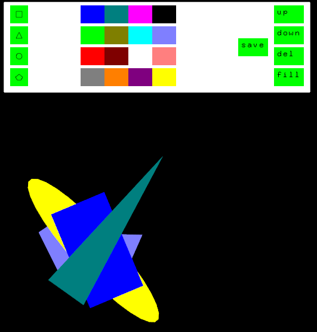
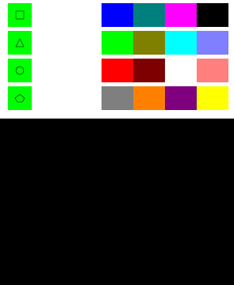
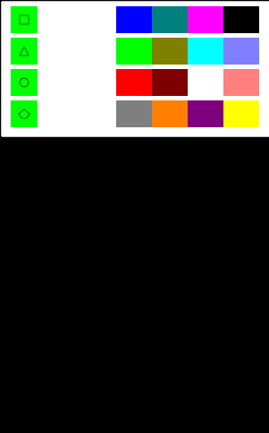
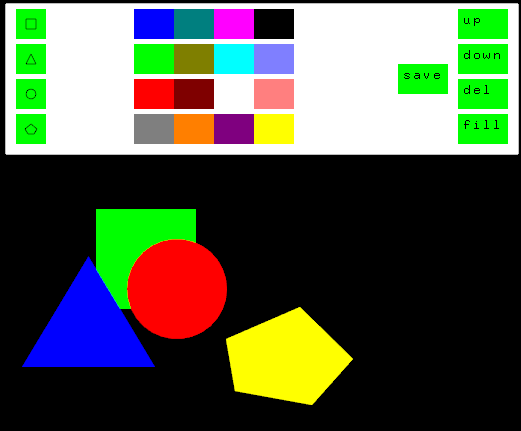
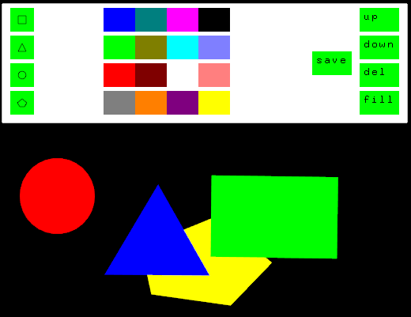
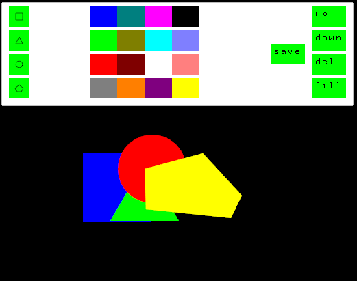

<h1>Trabalho 1 – Editor de Figuras Vetoriais</h1>

<h3> Descrição </h3>

Desenvolva um programa em C++ para fazer manipulações figuras vetoriais, algo semelhante às
ferramentas que o Microsoft Word oferece.

O programa deve permitir:

- Inserir/excluir figura.
- Cor da figura.
- Preenchimento da figura (Bônus).
- Editar tamanho da figura.
- Editar orientação da figura (giros de 90 graus).
- Enviar para frente/traz.
- Salvar em arquivo e carregar de arquivo.

Extras:

- [x] (+0,5) Sinalizar qual figura está selecionada.
- [x] (+1,0) Rotacionar figura em qualquer ângulo.
- [ ] (+1,5) Concatenar duas figuras (se tornando uma só) = agrupar.
- [x] (+1,0) Permitir inserir polígonos quaisquer.
- [ ] (+2,0) Preencher a figura qualquer (circular, polígono, triangulo, etc) com uma imagem
      (BMP).
- [ ] (+1,0) Painel mostrando uma label para cada figura presente na imagem.
- [ ] (+1,0) Checkbox permitindo deixar determinada figura invisível sem removê-la.

<h2> Getting Started </h2>

Toda a utilização do programa pode ser feita com o mouse, porém, existem teclas de atalhos com as mesmas funcionalidades caso haja preferência.

Para iniciar, compile o programa com a ferramenta CodeBlocks (Release 17.12). Por padrão, o programa irá procurar pelo arquivo `figuras.gr` a fim de carregar figuras pré definidas. Caso não haja tal arquivo, o programa se iniciará com uma tela vazia.

# Usabilidade

Ao iniciar o programa, o usuário poderá ver tanto as figuras as quais se estava editando anteriormente como um painel de edição do programa, com opções como adicionar, deletar e preencher figuras como mostrado na figura abaixo.

 
  

# Painel Principal

## Adicionar Imagens

Na parte esquerda do painel, se encontrará quatro botões, responsáveis por adicionar as figuras à tela. Respectivamente, os botões adicionam: quadrados, triângulos equiláteros, círculo e polígos de quantos lados quiser.

Para adicionar figuras simples (quadrados, triângulos e círculo), basta pressionar o botão com o desenho desejado. Uma vez selecionado, um círculo verde aparecerá em volta do cursor, mostrando que uma figura foi selecionada e sua cor será verde. Para alterar a cor antes de posicionar a figura, basta clicar na cor desejada e imediatamente, o cursor mudará de cor.

 
  

Caso se desejar criar figuras complexas, é possível utilizar a opção de polígono, onde cada clique feito irá marcar o vértice a ser criado. Assim como nas figuras simples, é possível alterar a cor durante a seleção do polígono. Para finalizar a criação do polígono, é possível apertar a tecla `enter` no teclado ou pressionar o primeiro vértice adcionado.

Para cancelar a criação do polígono, basta apertar a tecla `esc` ou pressionar qualquer área do painel principal.

 
  

## Manipulação de Figuras

Apenas com o mouse, é possível mudar a posição, tamanho e rotação de uma figura, além de alterar seu preenchimento, cor e trazer para frente ou para trás com auxilio do painel principal.

Para se manipular a figura, basta clicar uma vez nela que a mesma ficará em um estado de 'selecionada'. Quando selecionada, uma caixa de opções aparecerá em sua volta, sendo os quatro pontos nos vértices da caixa responsáveis por alterar seu tamanho e proporção. Para alterá-la, basta segurar e arrastar o vértice desejado para a direção que desejar.

 
  

Com o botão central da caixa de edição, é possível rotacionar a figura em sentido horário ou anti horário. Funcionando da mesma forma para redimensionar a figura, para rotacionar basta pressionar e arrastar o botão central em torno do próprio eixo de seu centro. Com a figura rotacionada, opções de redimensionamento ainda são possíveis.

 
  

## Demais Funções do Painel

Painel de cores: com a figura selecionada, é possível alterar a cor da figura pressionando a cor desejada nas opções centrais.

Up: trás a figura para frente em relação as demais (atalho: `+`)
  - Ao segurar a tecla `ctrl` e pressionar a opção, a figura irá para a primeira camada.
  
Down: trás a figura para trás em relação as demais (atalho: `-`)
  - Ao segurar a tecla `ctrl` e pressionar a opção, a figura irá para a última camada.

Del: deleta a figura do programa (atalho: `del`)\
Fill: altera o preenchimento da figura (atalho: `f`)\
Save: salva as figuras no arquivo `figuras.gr` (atalho: `ctrl + s`)

 
  

